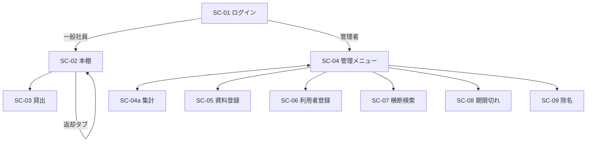

# 社内図書貸出管理システム 基本設計書

| 項目 | 内容 |
|------|------|
| システム名 | 社内図書貸出管理システム（company-library） |
| 版数 | 1.0 |
| 作成日 | 2026年8月 |
| 対象フェーズ | 基本設計 |

**関連ドキュメント**

仕様と設計の地図は [システム仕様書と設計書.md](./システム仕様書と設計書.md) です。

| 資料 | ファイル |
|------|---------|
| 説明資料 | [説明資料.md](./説明資料.md) |
| マニュアル | [マニュアル.md](./マニュアル.md) |
| バグ対応書 | [バグ対応書.md](./バグ対応書.md) |
| 詳細設計書 | [詳細設計書.md](./詳細設計書.md) |
| サーバー・サーバレス概要 | [サーバーサーバレス概要.md](./サーバーサーバレス概要.md) |
| 保守・運用手順書 | [保守運用手順書.md](./保守運用手順書.md) |
| 技術スタック一覧 | [技術スタック一覧.md](./技術スタック一覧.md) |
| 主要機能一覧 | [主要機能一覧.md](./主要機能一覧.md) |
| 外部サービス・API | [外部サービスAPI.md](./外部サービスAPI.md) |
| 環境変数・シークレット | [環境変数とシークレット.md](./環境変数とシークレット.md) |
| データベースの種類 | [データベース種類.md](./データベース種類.md) |
| スキーマ・マイグレーション | [スキーマ設計とマイグレーション.md](./スキーマ設計とマイグレーション.md) |
| データバックアップ・リストア | [データバックアップリストア.md](./データバックアップリストア.md) |
| SQL・ORM 方針 | [SQLとORM方針.md](./SQLとORM方針.md) |
| AWS セットアップ | [AWSセットアップ.md](./AWSセットアップ.md) |
| セキュリティ対策 | [セキュリティ対策.md](./セキュリティ対策.md) |
| ログ管理 | [ログ管理.md](./ログ管理.md) |
| エラートラッキング | [エラートラッキング.md](./エラートラッキング.md) |
| バグ・課題管理 | [バグ課題管理.md](./バグ課題管理.md) |
| 定期メンテナンス | [定期メンテナンス.md](./定期メンテナンス.md) |
| 障害予防の3点 | [障害予防の3点.md](./障害予防の3点.md) |
| ドキュメント管理 | [ドキュメント管理.md](./ドキュメント管理.md) |
| システム仕様書・設計書 | [システム仕様書と設計書.md](./システム仕様書と設計書.md) |
| API仕様 | [API仕様.md](./API仕様.md) |
| 運用マニュアル | [運用マニュアル.md](./運用マニュアル.md) |
| よくあるトラブル | [よくあるトラブル.md](./よくあるトラブル.md) |
| 退職・異動のアカウント | [マニュアル](./マニュアル.md) |
| 共有アカウント | [共有アカウント管理.md](./共有アカウント管理.md) |

---

## 目次

1. [システム概要](#1-システム概要)
2. [システム構成](#2-システム構成)
3. [機能設計](#3-機能設計)
4. [画面設計](#4-画面設計)
5. [データベース設計](#5-データベース設計)
6. [API・ルーティング設計](#6-apiルーティング設計)
7. [認証・認可設計](#7-認証認可設計)
8. [場所制限設計](#8-場所制限設計)
9. [外部連携設計](#9-外部連携設計)
10. [非機能要件](#10-非機能要件)
11. [設定・環境](#11-設定環境)
12. [今後の拡張](#12-今後の拡張)

---

## 1. システム概要

### 1-1. 目的

社内に配置された図書（技術書・ビジネス書等）の **登録・貸出・返却・検索** を Web ブラウザ上で一元管理し、貸出状況の可視化と返却期限の管理を行う。

### 1-2. 対象ユーザー

| ユーザー種別 | 説明 | 権限（role） |
|-------------|------|-------------|
| 一般社員 | 図書の閲覧・貸出・返却 | `user` |
| 管理者 | 資料・利用者の管理、期限切れ確認 | `admin` |

### 1-3. スコープ

| 対象 | 内容 |
|------|------|
| イン scope | ログイン、本棚表示、ISBN 貸出、返却、管理者 CRUD、横断検索、場所制限 |
| out of scope（現時点） | 年度末処理、貸出予約、GUI システム設定、メール通知、Native アプリ |

---

## 2. システム構成

### 2-1. アーキテクチャ

本システムは **モノリシック Web アプリケーション** として構成する。フロントエンドは Inertia.js により SPA 風 UI を実現し、サーバーサイドレンダリングと API 通信を一体化する。

全体構成図（draw.io）: [system-architecture.drawio](./system-architecture.drawio)  
Git 上のコードの分かれ方（本サーバー ＝ AWS）: [サーバーサーバレス概要.md](./サーバーサーバレス概要.md)  
手順（CDK）: [AWSセットアップ.md](./AWSセットアップ.md)

```
┌─────────────────────────────────────────────────────────┐
│                    クライアント（ブラウザ）                 │
│              PC / スマートフォン（Chrome, Safari 等）       │
└───────────────────────────┬─────────────────────────────┘
                            │ HTTPS
                            ▼
┌─────────────────────────────────────────────────────────┐
│              ALB（ACM。HTTP は HTTPS へ転送）              │
└───────────────────────────┬─────────────────────────────┘
                            │
                            ▼
┌─────────────────────────────────────────────────────────┐
│                   ECS Fargate                            │
│              Nginx + PHP-FPM 8.3+（コンテナ）             │
├─────────────────────────────────────────────────────────┤
│  Laravel 13（アプリケーション層）                         │
│  ├─ Controllers（BookController, Auth...）               │
│  ├─ Models（User, Book, Loan）                           │
│  ├─ Middleware（auth, admin, return.location）           │
│  └─ Services（ReturnLocationGuard）                      │
├─────────────────────────────────────────────────────────┤
│  Inertia.js + React 18（プレゼンテーション層）            │
│  └─ Pages（Dashboard, BorrowScan, Admin/*）              │
└───────────────────────────┬─────────────────────────────┘
                            │
                            ▼
┌─────────────────────────────────────────────────────────┐
│         RDS MySQL（本サーバー）                            │
│              users / books / loans                       │
└─────────────────────────────────────────────────────────┘
                            │
                            ▼（管理者・ISBN 検索時）
┌─────────────────────────────────────────────────────────┐
│  外部 API：OpenBD（書誌情報）、NDL サムネイル（表紙）       │
└─────────────────────────────────────────────────────────┘
```

### 2-2. 技術スタック

詳細は [技術スタック一覧.md](./技術スタック一覧.md) です。

| レイヤ | 技術 | バージョン目安 |
|--------|------|--------------|
| 言語（サーバー） | PHP | 8.3+ |
| フレームワーク | Laravel | 13.x |
| フロント | React | 18.x |
| SPA 連携 | Inertia.js | 2.x |
| ルート生成 | Ziggy | 2.x |
| CSS | Tailwind CSS | 3.x |
| ビルド | Vite | 8.x |
| DB | RDS MySQL（本サーバー） | — |
| 認証 | Laravel Breeze（セッション認証） | — |

### 2-3. ディレクトリ構成（主要）

```
company-library/
├── app/
│   ├── Http/Controllers/BookController.php   # 業務ロジック中核
│   ├── Http/Middleware/
│   │   ├── EnsureAdmin.php
│   │   └── EnsureReturnLocation.php
│   ├── Models/                               # User, Book, Loan
│   └── Services/ReturnLocationGuard.php
├── config/library.php                        # 場所制限設定
├── database/migrations/                      # スキーマ定義
├── resources/js/
│   ├── Pages/                                # 画面コンポーネント
│   ├── Components/                           # 共通 UI
│   └── utils/                                # 表示ロジック共通化
├── routes/web.php                            # ルート定義
└── docs/                                     # ドキュメント群
```

---

## 3. 機能設計

### 3-1. 機能一覧

分類ごとの概要（認証・API・バッチ含む）は [主要機能一覧.md](./主要機能一覧.md) です。

| ID | 機能名 | 利用者 | 状態 | 概要 |
|----|--------|--------|------|------|
| F-01 | ログイン | 全員 | 実装済 | 社員番号 + パスワード |
| F-02 | 本棚一覧 | 一般 | 実装済 | 蔵書表示・検索・在庫表示 |
| F-03 | 図書貸出 | 一般 | 実装済 | ISBN 手入力 / バーコードスキャン |
| F-04 | 図書返却 | 一般 | 実装済 | 借用中一覧から返却 |
| F-05 | 場所制限 | 一般 | 実装済 | 貸出・返却を社内 IP のみに限定 |
| F-06 | 資料登録 | 管理者 | 実装済 | ISBN 自動取得・在庫追加 |
| F-07 | 利用者登録 | 管理者 | 実装済 | 最大 5 名一括登録 |
| F-08 | 横断検索 | 管理者 | 実装済 | 資料・利用者の統合検索 |
| F-09 | 期限切れ一覧 | 管理者 | 実装済 | 超過貸出の一覧・バッジ |
| F-09a | 期限切れ Slack 通知 | 管理者・一般 | 実装済 | 未通知の期限切れを 1 分ごとに投稿。一般利用者へ DM |
| F-10 | 除名 | 管理者 | 実装済 | 利用者アカウント削除 |
| F-11 | 年度末処理 | 管理者 | 未実装 | — |
| F-12 | 貸出予約 | 管理者 | 未実装 | — |
| F-13 | システム設定 | 管理者 | 未実装 | — |

### 3-2. 機能詳細

#### F-03 図書貸出

```
入力: ISBN（10〜13桁）, duration（1 / 7 / 14 / 30 日）
処理:
  1. ISBN 正規化（ハイフン除去）
  2. 場所制限チェック（Middleware）
  3. 同一 ISBN の未貸出冊を copy_number 昇順で1件取得
  4. due_date 計算（1分 / 7日 / 14日 / 1ヶ月）
  5. loans レコード作成
出力: 成功メッセージ + 返却期限
```

| duration | due_date 計算 |
|----------|--------------|
| 1 | 現在 + 1 分 |
| 7 | 現在 + 7 日（当日終了） |
| 14 | 現在 + 14 日（当日終了） |
| 30 | 現在 + 1 ヶ月（当日終了） |

#### F-04 図書返却

```
入力: book_id（URL パラメータ）
処理:
  1. 場所制限チェック（Middleware）
  2. ログインユーザー × book_id × returned_at IS NULL を検索
  3. returned_at = now() で更新
出力: 成功メッセージ
```

#### F-06 資料登録（複数冊対応）

- 同一 ISBN で **冊ごとに books レコードを追加**（方式 A）
- `copy_number` を ISBN グループ内で自動採番（1, 2, 3…）
- ISBN の UNIQUE 制約は **撤廃**（`2026_08_10_000003` マイグレーション）

---

## 4. 画面設計

### 4-1. 画面一覧

| 画面 ID | 画面名 | パス | コンポーネント | 権限 |
|---------|--------|------|---------------|------|
| SC-01 | ログイン | `/login` | Auth/Login.jsx | ゲスト |
| SC-02 | マイページ（本棚） | `/dashboard` | Dashboard.jsx | 一般 |
| SC-03 | 貸出カウンター | `/borrow-scan` | BorrowScan.jsx | 一般 |
| SC-04 | 管理メニュー | `/admin/menu` | Admin/Menu.jsx | 管理者 |
| SC-04a | 集計 | `/admin/grafana` | Admin/Grafana.jsx | 管理者 |
| SC-05 | 資料登録 | `/admin/books/create` | Admin/BookCreate.jsx | 管理者 |
| SC-06 | 利用者登録 | `/users/create` | Admin/UserCreate.jsx | 管理者 |
| SC-07 | 横断検索 | `/admin/search` | Admin/Search.jsx | 管理者 |
| SC-08 | 期限切れ一覧 | `/admin/overdue` | Admin/Overdue.jsx | 管理者 |
| SC-09 | 除名一覧 | `/users/discard` | Admin/UserDiscard.jsx | 管理者 |
| SC-10 | プロフィール | `/profile` | Profile/Edit.jsx | 全員 |

### 4-2. 画面遷移



### 4-3. 主要画面の Inertia Props

| 画面 | 主要 Props |
|------|-----------|
| Dashboard | `books`, `myLoans`, `returnLocation`, `borrowLocation` |
| BorrowScan | `libraryLocation`, `flash` |
| Admin/Menu | `overdueCount` |
| Admin/Grafana | `stats`, `categories`, `loansByDay`, `returnsByDay`, `topBooks`, `overdueLoans`, `dueSoonLoans` |
| Admin/Search | `books`, `users`, `stats` |
| Admin/BookCreate | `flash`, `errors` |

---

## 5. データベース設計

エンジンの種類（本サーバー RDS MySQL。PostgreSQL・MongoDB は未使用）は [データベース種類.md](./データベース種類.md) です。スキーマの変え方は [スキーマ設計とマイグレーション.md](./スキーマ設計とマイグレーション.md) です。

### 5-1. ER 図

```mermaid
erDiagram
    users ||--o{ loans : "借りる"
    books ||--o{ loans : "貸出対象"
    books }o..o| cover_images : "cover が UUID のとき（FKなし）"

    users {
        bigint id PK
        string name
        string email UK
        string user_code UK
        string role
        string password
        timestamp email_verified_at
        string remember_token
        timestamps created_at_updated_at
    }

    books {
        bigint id PK
        string title
        string isbn IDX
        smallint copy_number
        string category
        text cover
        string status
        timestamps created_at_updated_at
    }

    cover_images {
        uuid id PK
        string mime
        int byte_size
        blob data
        timestamps created_at_updated_at
    }

    loans {
        bigint id PK
        bigint user_id FK
        bigint book_id FK
        timestamp borrowed_at
        datetime due_date
        tinyint duration_days
        timestamp returned_at
        timestamp slack_notified_at
        timestamps created_at_updated_at
    }
```

### 5-2. テーブル定義

#### users（利用者）

| カラム | 型 | NULL | 説明 |
|--------|-----|------|------|
| id | BIGINT | NO | PK |
| name | VARCHAR | NO | 氏名 |
| email | VARCHAR | NO | UK、ログイン補助 |
| user_code | VARCHAR | NO | UK、社員番号（例: EMP-0002） |
| role | VARCHAR | NO | `user` / `admin`、default `user` |
| password | VARCHAR | NO | bcrypt ハッシュ |
| email_verified_at | TIMESTAMP | YES | メール認証 |
| remember_token | VARCHAR | YES | セッション維持 |
| created_at / updated_at | TIMESTAMP | YES | — |

#### books（書籍・冊単位）

| カラム | 型 | NULL | 説明 |
|--------|-----|------|------|
| id | BIGINT | NO | PK |
| title | VARCHAR | NO | タイトル |
| isbn | VARCHAR | YES | ISBN（**重複可**・複数冊対応） |
| copy_number | SMALLINT | NO | 同一 ISBN 内の冊番号、default 1 |
| category | VARCHAR | YES | 技術書 / デザイン / ビジネス |
| cover | MEDIUMTEXT | YES | 表紙 URL、または自前画像の `/covers/{uuid}` |
| status | VARCHAR | NO | `available` / `rented`（参考値） |
| created_at / updated_at | TIMESTAMP | YES | — |

**インデックス:** `isbn`（非 UNIQUE、検索用）

**業務ルール:**

- 貸出状態の正は `loans.returned_at IS NULL` で判定（`books.status` は補助）
- 同一 ISBN の在庫数 = `books` レコード数

#### cover_images（自前表紙）

| カラム | 型 | NULL | 説明 |
|--------|-----|------|------|
| id | UUID | NO | PK |
| mime | VARCHAR | NO | Content-Type |
| byte_size | INT | NO | バイト数 |
| data | MEDIUMBLOB | NO | 画像本体 |
| created_at / updated_at | TIMESTAMP | YES | — |

`GET /covers/{id}` で表示する。ログイン必須。管理者のみアップロード可。

#### loans（貸出履歴）

| カラム | 型 | NULL | 説明 |
|--------|-----|------|------|
| id | BIGINT | NO | PK |
| user_id | BIGINT | NO | FK → users.id（CASCADE DELETE） |
| book_id | BIGINT | NO | FK → books.id（CASCADE DELETE） |
| borrowed_at | TIMESTAMP | NO | 貸出日時 |
| due_date | TIMESTAMP | YES | 返却期限（datetime） |
| duration_days | TINYINT | YES | 1 / 7 / 14 / 30 |
| returned_at | TIMESTAMP | YES | 返却日時（NULL = 貸出中） |
| slack_notified_at | TIMESTAMP | YES | Slack 通知済み時刻（未通知は NULL） |
| created_at / updated_at | TIMESTAMP | YES | — |

**制約:**

- 1 冊（book_id）に対し、`returned_at IS NULL` のレコードは同時に 1 件のみ（アプリ層で保証）

### 5-3. 主要エンティティ関係

| 関係 | カーディナリティ | 説明 |
|------|----------------|------|
| User → Loan | 1 : N | 1 人が複数回借りられる。FK CASCADE |
| Book → Loan | 1 : N | 1 冊に複数の過去履歴。FK CASCADE |
| Book → currentLoan | 1 : 0..1 | 未返却は最大 1 件（アプリ層） |
| Book → CoverImage | 0..1（論理） | `cover` が `/covers/{uuid}` のとき。DB の FK は無い |

---

## 6. API・ルーティング設計

OpenAPI / Swagger / Postman は無い。[API仕様.md](./API仕様.md)。経路の正は `routes/web.php` である。

### 6-1. 一般社員向け

| メソッド | パス | 名前 | Middleware | 処理 |
|---------|------|------|-----------|------|
| GET | `/dashboard` | dashboard | auth, verified | 本棚・借用中 |
| GET | `/borrow-scan` | books.borrowScan | auth, verified | 貸出画面 |
| POST | `/books/borrow/exec` | books.borrow.exec | auth, verified, **location:borrow** | 貸出実行 |
| POST | `/books/{book}/return` | books.return | auth, verified, **location:return** | 返却実行 |

### 6-2. 管理者向け

| メソッド | パス | 名前 | Middleware | 処理 |
|---------|------|------|-----------|------|
| GET | `/admin/menu` | admin.menu | auth, verified, **admin** | メニュー |
| GET | `/admin/grafana` | admin.grafana | auth, verified, **admin** | 集計 |
| GET | `/admin/books/create` | admin.books.create | admin | 資料登録画面 |
| GET | `/admin/books/lookup` | admin.books.lookup | admin | ISBN 検索 JSON |
| POST | `/admin/books/store` | admin.books.store | admin | 資料登録 |
| GET | `/admin/search` | admin.search | admin | 横断検索 |
| GET | `/admin/overdue` | admin.overdue | admin | 期限切れ |
| GET | `/users/create` | admin.users.create | admin | 利用者登録 |
| POST | `/users/store` | admin.users.store | admin | 利用者一括登録 |
| GET | `/users/discard` | admin.users.discard | admin | 除名一覧 |
| DELETE | `/users/discard/{id}` | admin.users.discard.destroy | admin | 除名実行 |

### 6-3. 管理者 ISBN 検索 API

**`GET /admin/books/lookup?isbn={13桁}`**

| ステータス | レスポンス |
|-----------|-----------|
| 200 | `{ found, isbn, title, cover, existingCopies }` |
| 404 | `{ found: false, message }` — 手動入力誘導 |
| 422 | `{ message }` — バリデーションエラー |

---

## 7. 認証・認可設計

### 7-1. 認証

| 項目 | 設計 |
|------|------|
| 方式 | セッション認証（Laravel Breeze） |
| ログインキー | `user_code`（社員番号） |
| パスワード | bcrypt |
| セッション | Cookie ベース |

**ログイン処理:**

1. `user_code` を大文字に正規化
2. `user_code` + `password` で認証
3. 管理者 → `/admin/menu`、一般 → `/dashboard` へリダイレクト

### 7-2. 認可

| Middleware | 条件 | 拒否時 |
|-----------|------|--------|
| `auth` | ログイン済み | `/login` へ |
| `verified` | メール認証済み | 認証画面へ |
| `admin` | `role === 'admin'` | dashboard + エラー |
| `return.location:{action}` | 許可 IP 帯 | 前画面 + エラー |

### 7-3. 権限マトリクス

| 機能 | user | admin |
|------|:----:|:-----:|
| 本棚・貸出・返却 | ○ | —（管理者は dashboard へリダイレクト） |
| 資料登録 | × | ○ |
| 利用者管理 | × | ○ |
| 横断検索・期限切れ | × | ○ |

---

## 8. 場所制限設計

### 8-1. 概要

貸出・返却を **指定 IP アドレス帯** からのみ許可する。Wi-Fi 名（SSID）はブラウザから取得不可のため、接続元 IP で判定する。

### 8-2. コンポーネント

| クラス | 役割 |
|--------|------|
| `ReturnLocationGuard` | IP 判定・メッセージ生成・status 配列 |
| `EnsureReturnLocation` | Middleware、action 引数（`borrow` / `return`） |

### 8-3. 判定フロー

```
リクエスト受信
    │
    ├─ RETURN_LOCATION_RESTRICTED = false → 許可
    │
    ├─ IP = 127.0.0.1 かつ ALLOW_LOCALHOST = true → 許可
    │
    └─ IP ∈ RETURN_ALLOWED_NETWORKS → 許可 / それ以外 → 拒否
```

### 8-4. フロント連携

| 画面 | Props | UI |
|------|-------|-----|
| Dashboard | `borrowLocation`, `returnLocation` | ボタン無効化、案内表示 |
| BorrowScan | `libraryLocation` | 貸出ボタン無効化、デバッグ IP 表示（local） |

---

## 9. 外部連携設計

エンドポイント・タイムアウト・必須かどうかは [外部サービスAPI.md](./外部サービスAPI.md) です。

| 連携先 | 用途 | プロトコル | 呼び出し元 |
|--------|------|-----------|-----------|
| OpenBD API | ISBN → 書誌情報・表紙（優先） | HTTPS GET | `BookIsbnLookup` |
| 版元ドットコム | 書影 | HTTPS GET | `BookCoverResolver` |
| Open Library | 書影（版元に無いとき） | HTTPS GET | `BookCoverResolver` / `bookCover.js` |
| Google Books API | OpenBD に無い書誌・表紙 | HTTPS GET | `GoogleBooksLookup` / ブラウザの書籍検索 |
| 国立国会図書館 | 題名 → ISBN | HTTPS GET | `NdlBookLookup` |
| Slack Incoming Webhook | 期限切れの管理チャンネル | HTTPS POST | バッチ `OverdueSlackNotifier` |
| Slack Web API | 一般への DM | HTTPS | 同（メール一致時） |
| メール | パスワード再設定 | SMTP 等 | Laravel Mail |

**OpenBD エンドポイント:**

```
GET https://api.openbd.jp/v1/get?isbn={isbn13}
```

**Google Books エンドポイント:**

```
GET https://www.googleapis.com/books/v1/volumes?q=isbn:{isbn13}
```

**障害時:** 版元ドットコム → Open Library → Google Books。どれも無ければ手動入力（BookCreate.jsx）

---

## 10. 非機能要件

### 10-1. 性能

| 項目 | 目標（想定） |
|------|-------------|
| 画面表示 | 3 秒以内（社内 LAN） |
| 同時利用者 | 〜50 名（社内規模想定） |
| ISBN 検索 | OpenBD タイムアウト 5 秒 |


### 10-2. 可用性

| 項目 | 方針 |
|------|------|
| 稼働時間 | 社内業務時間（24/7 必須ではない） |
| バックアップ | DB 日次バックアップ（手順は [データバックアップリストア](./データバックアップリストア.md)）。頻度の一覧は [定期メンテナンス](./定期メンテナンス.md) |

### 10-3. セキュリティ

詳細は [セキュリティ対策.md](./セキュリティ対策.md) です。

| 項目 | 対策 |
|------|------|
| 通信 | HTTPS（本番） |
| パスワード | bcrypt、初期パスワード変更推奨 |
| CSRF | Laravel 標準トークン |
| SQL インジェクション | Eloquent ORM（[SQLとORM方針](./SQLとORM方針.md)） |
| XSS | React エスケープ + Inertia |
| 権限昇格 | Middleware + `isAdmin()` |
| 場所制限 bypass | サーバー側 Middleware（フロントのみでは不可） |

### 10-4. 保守性

| 項目 | 方針 |
|------|------|
| テスト | PHPUnit（Feature 25 件） |
| フロントビルド | Vite、`npm run build` |
| 設定 | `.env` + `config/library.php` |
| 課題管理 | JIRA 等は未連携。[バグ課題管理](./バグ課題管理.md) |
| 定期保守 | [定期メンテナンス](./定期メンテナンス.md) |
| ドキュメント | Git の `docs/`。[ドキュメント管理](./ドキュメント管理.md) |
| 仕様・設計 | [システム仕様書と設計書](./システム仕様書と設計書.md) |
| API 仕様 | OpenAPI なし。[API仕様](./API仕様.md) |
| アカウント | 1 人 1 件。[共有アカウント管理](./共有アカウント管理.md) |

---

## 11. 設定・環境

### 11-1. 環境変数（主要）

一覧・秘密の扱いは [環境変数とシークレット.md](./環境変数とシークレット.md) です。置き場は [環境変数とシークレット](./環境変数とシークレット.md) です。ひな形は `.env.production.example`（本サーバー）です。

| 変数 | 説明 | 例 |
|------|------|-----|
| `APP_ENV` | 環境 | `production` |
| `APP_URL` | アプリ URL | `https://library.example.co.jp` |
| `DB_CONNECTION` | DB 種別 | `mysql` |
| `RETURN_LOCATION_RESTRICTED` | 場所制限 ON/OFF | `true` |
| `RETURN_ALLOWED_NETWORKS` | 許可 CIDR | `192.168.0.0/24` |
| `RETURN_LOCATION_NAME` | 表示名 | `オフィスWi-Fi` |
| `RETURN_ALLOW_LOCALHOST` | localhost 許可 | `false` |
| `SLACK_OVERDUE_WEBHOOK_URL` | 期限切れ Slack Incoming Webhook | （空なら送信しない） |

### 11-2. 環境別構成（想定）

| 環境 | DB | ビルド | 場所制限 |
|------|-----|--------|---------|
| 本サーバー | RDS MySQL | `npm run build` | ON |

---

## 12. 今後の拡張

| 機能 | 設計上の検討事項 |
|------|----------------|
| 年度末処理 | 年度単位の貸出集計、棚卸レポート |
| 貸出予約 | `reservations` テーブル、ISBN 単位の待ち行列 |
| システム設定 GUI | 貸出期間・IP 帯を管理画面から変更 |
| 管理者代理返却 | 窓口返却用 admin API |
| 期限前リマインド | 期限前メール / Slack（現状は期限切れ当日以降の平日通知のみ） |
| book_copies 分離 | 方式 B：マスタ + 在庫テーブルへの移行 |

---

## 改訂履歴

| 版 | 日付 | 変更内容 | 担当 |
|----|------|---------|------|
| 1.0 | 2026-09-28 | ER 図は本資料第5章のみ（draw.io を削除） | — |
| 1.0 | 2026-09-28 | ローカル開発・SQLite の記述を削除 | — |
| 1.0 | 2026-09-17 | 本サーバー DB を RDS MySQL に変更（費用最小。Aurora は使わない） | — |
| 1.0 | 2026-09-11 | AWS 検証定義を削除。本サーバーセットアップを追加 | — |
| 1.0 | 2026-09-09 | SQL 学習用 BigQuery 資料を追加 | — |
| 1.0 | 2026-08-10 | 初版作成 | — |
| 1.0 | 2026-09-02 | Grafanaダッシュボード資料を追加 | — |
| 1.0 | 2026-09-02 | 管理画面と Grafana 集計の切替を追加 | — |

---

## 付録 A：クラス責務一覧

| クラス / ファイル | 責務 |
|------------------|------|
| `BookController` | 貸出・返却・管理 CRUD の中核 |
| `Book` | 書籍エンティティ、在庫検索 |
| `CoverImage` | 自前表紙のバイナリ |
| `Loan` | 貸出履歴 |
| `User` | 認証主体、権限判定 |
| `ReturnLocationGuard` | IP ベース場所制限 |
| `groupBooksByIsbn.js` | 本棚 UI 用 ISBN グループ化 |
| `loanDisplay.js` | 期限・超過日数表示 |
| `bookCover.js` | 表紙 URL 生成 |

## 付録 B：ドキュメント体系

置き場と更新のルールは [ドキュメント管理.md](./ドキュメント管理.md) です。

```
README.md                ← リポジトリの入口（docs への案内）
docs/
├── ドキュメント管理.md  ← 置き場と最新化
├── システム仕様書と設計書.md ← 仕様・設計資料の対応
├── API仕様.md           ← OpenAPI / Swagger / Postman は未使用
├── 運用マニュアル.md    ← 画面操作とサーバー運用の案内
├── よくあるトラブル.md  ← 頻出の症状と対処
├── 共有アカウント管理.md ← 1 人 1 アカウント
├── 基本設計書.md        ← 設計・構成
├── 詳細設計書.md        ← 処理・画面項目・バリデーション
├── 説明資料.md          ← 概要（非エンジニア向け）
├── マニュアル.md        ← 社員・管理者向け操作説明
├── バグ対応書.md        ← 障害対応
├── 保守運用手順書.md    ← 日常点検・バックアップ・更新
├── system-architecture.drawio ← 全体構成図
├── データベース種類.md   ← RDS MySQL（PostgreSQL・MongoDB は未使用）
├── スキーマ設計とマイグレーション.md ← スキーマ概要と artisan migrate
├── データバックアップリストア.md ← RDS バックアップと復元
├── 障害予防の3点.md   ← 自動バックアップ・外部死活・手順書
├── SQLとORM方針.md       ← Eloquent と生 SQL の範囲
├── AWSセットアップ.md     ← CDK（Fargate + RDS MySQL）。未デプロイ
├── セキュリティ対策.md    ← CORS / CSRF / XSS / SQL インジェクション
├── ログ管理.md            ← CloudWatch Logs。Sentry は未使用
├── エラートラッキング.md  ← 例外は CloudWatch。SaaS は未使用
├── バグ課題管理.md      ← JIRA / Trello / Notion は未連携
├── 定期メンテナンス.md  ← 日次・週次・月次
├── サーバーサーバレス概要.md ← Git 上のサーバー / サーバレスコード
├── 技術スタック一覧.md   ← 言語・FW・DB・外部サービス
├── 主要機能一覧.md      ← 認証・貸出・API・バッチ
├── 外部サービスAPI.md   ← 依存する外部 API
├── 環境変数とシークレット.md ← 本サーバーの秘密情報
```
