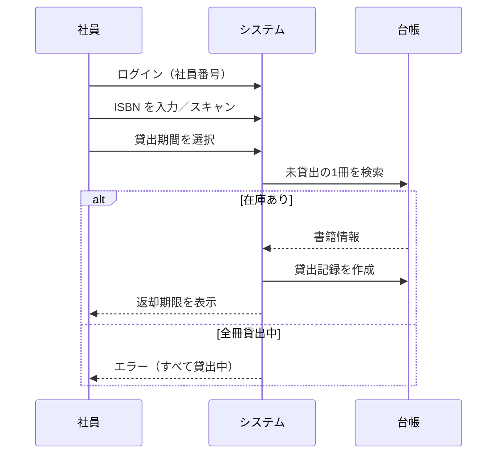
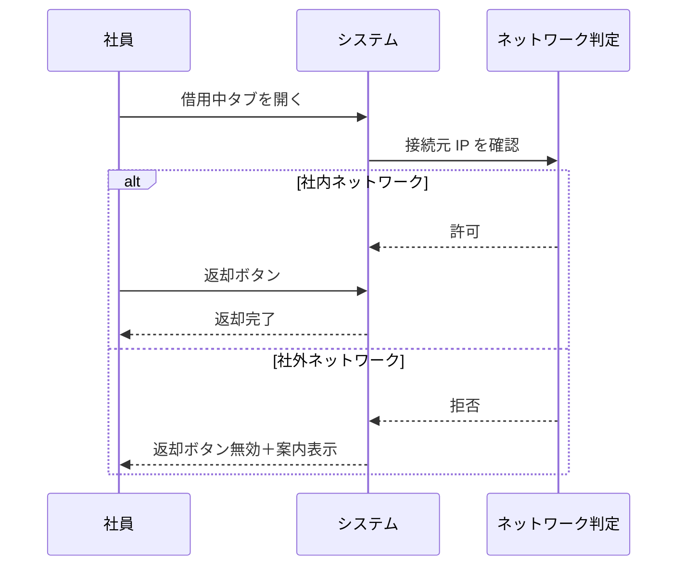
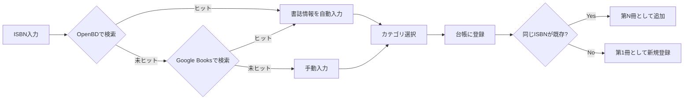

# 社内図書貸出管理システム 説明資料

**対象:** 経営層・管理者・一般社員（システム概要の共有用）  
**最終更新:** 2026年8月  
**関連ドキュメント:** [README.md](../README.md) / [マニュアル](./マニュアル.md) / [運用マニュアル](./運用マニュアル.md) / [よくあるトラブル](./よくあるトラブル.md) / [マニュアル](./マニュアル.md) / [共有アカウント管理](./共有アカウント管理.md) / [主要機能一覧](./主要機能一覧.md) / [外部サービスAPI](./外部サービスAPI.md) / [API仕様](./API仕様.md) / [保守運用手順書](./保守運用手順書.md) / [システム仕様書と設計書](./システム仕様書と設計書.md)

---

## 1. はじめに

### 1-1. 背景・目的

社内に置いてある技術書・ビジネス書などの **貸出・返却・在庫管理** を、紙や Excel ではなく Web 上で一元管理することを目的としたシステムです。

| 従来の課題 | 本システムによる解決 |
|-----------|---------------------|
| 誰がどの本を借りているか分からない | 貸出履歴をリアルタイムで記録 |
| 返却期限の管理が煩雑 | 期限の自動計算・期限切れ一覧 |
| 同じ ISBN の複数冊を管理できない | 冊ごとに登録し在庫数を表示 |
| 社外から勝手に返却される | 返却は指定ネットワーク（社内 Wi-Fi）のみ |

### 1-2. システムの位置づけ

```
┌─────────────────────────────────────────┐
│         社内図書貸出管理システム           │
│  （ブラウザからアクセスする Web アプリ）    │
└─────────────────┬───────────────────────┘
                  │
     ┌────────────┼────────────┐
     ▼            ▼            ▼
  一般社員      管理者       データベース
 （借りる・     （登録・       （書籍・
   返却）       検索・管理）    貸出履歴）
```

---

## 2. 利用者と権限

### 2-1. 2種類のユーザー

| 区分 | ログイン後の画面 | できること |
|------|----------------|-----------|
| **一般社員** | マイページ（本棚） | 蔵書の閲覧、借りる、返却 |
| **管理者** | 管理メニュー | 上記に加え、資料・利用者の登録・検索・除名 |

### 2-2. 認証方式

- **社員番号** + **パスワード** でログイン（例: `EMP-0002`）
- 管理者はログイン後、自動的に管理メニューへ遷移
- 新入社員は管理者が「利用者登録」でアカウントを発行

---

## 3. 機能一覧

詳細は [主要機能一覧](./主要機能一覧.md) です。

### 3-1. 一般社員向け機能

| 機能 | 説明 |
|------|------|
| 📚 本棚から探す | 3D 風の本棚 UI で蔵書を一覧。タイトル・ISBN・カテゴリで検索 |
| 📖 本を借りる | ISBN の手入力またはカメラバーコードスキャンで貸出 |
| 🔄 自分の借用中 | 借りている本の一覧、返却期限、返却操作 |
| 在庫表示 | 同じ本が複数冊ある場合「在庫 2/3 冊」と表示 |

**貸出期間（選択式）**

- 1週間
- 2週間（標準）
- 1ヶ月
- 1分間（テスト用。期限切れ後に Slack 通知の確認ができる）

### 3-2. 管理者向け機能

| メニュー | 状態 | 説明 |
|---------|------|------|
| 資料登録 | ✅ 利用可 | ISBN から書誌情報を自動取得し台帳に追加。同一 ISBN の在庫追加も可 |
| 利用者登録 | ✅ 利用可 | 最大 5 名分を一括登録 |
| 資料・利用者検索 | ✅ 利用可 | 資料の貸出状況・利用者の借用状況を横断検索 |
| 返却期限切れ | ✅ 利用可 | 期限超過の貸出一覧（メニューに件数バッジ） |
| 除名一覧 | ✅ 利用可 | 退職者等のアカウント削除（貸出中は不可） |

---

## 4. 業務フロー

### 4-1. 図書を借りる流れ



### 4-2. 図書を返却する流れ



> **ポイント:** **借りる・返却** ともに、社内 Wi-Fi 等の指定ネットワークからのみ可能です（設定による）。

### 4-3. 管理者：新着書籍の登録



---

## 5. 特色機能の説明

### 5-1. 複数冊対応（同一 ISBN）

同じタイトルの本が **2冊以上** ある場合の運用です。

| 項目 | 内容 |
|------|------|
| 登録 | 同じ ISBN で「在庫を1冊追加」 |
| 貸出 | スキャン1回で **空いている1冊** を自動割当 |
| 表示 | 本棚に「在庫 2/3 冊」、管理画面に「第2冊」 |

### 5-2. 貸出・返却場所の制限

| 操作 | 場所 |
|------|------|
| 借りる | 社内ネットワークのみ（設定による） |
| 返却する | 社内ネットワークのみ（設定による） |

**判定方法:** ブラウザから Wi-Fi 名は取得できないため、接続元 **IP アドレス帯** で判定します。

**利用者への案内例:**

> 図書の **借りる・返却** は、オフィスの社内 Wi-Fi に接続したうえで行ってください。

### 5-3. ISBN バーコードスキャン

スマートフォンのカメラで本の背表紙バーコードを読み取り、手入力の手間を省けます。  
PC からは手入力でも利用可能です。

---

## 6. 画面構成（イメージ）

### 一般社員：マイページ

```
┌──────────────────────────────────────┐
│  社内図書マイページ                    │
├──────────────────────────────────────┤
│ [📚 本棚から探す] [🔄 自分の借用中(1)] │
├──────────────────────────────────────┤
│  🔍 キーワード検索                      │
│  [すべて][技術書][デザイン][ビジネス]    │
│                                      │
│  ┌────┐ ┌────┐ ┌────┐               │
│  │書影│ │書影│ │書影│  ← 本棚UI     │
│  │在庫│ │全冊│ │    │               │
│  │2/3 │ │貸出│ │    │               │
│  └────┘ └────┘ └────┘               │
│                    [📖 本を借りる]    │
└──────────────────────────────────────┘
```

### 管理者：管理メニュー

```
┌──────────────────────────────────────┐
│     図書貸出管理システム               │
│     管理メニュー                       │
├──────────────────────────────────────┤
│ [資料登録] [全資料編集] [Excel一括]     │
│ [検索] [利用者登録] [除名] [期限切れ]   │
├──────────────────────────────────────┤
│     [🚪 ログアウト]                    │
└──────────────────────────────────────┘
```

---

## 7. 技術概要（参考）

詳細は [技術スタック一覧](./技術スタック一覧.md) です。外部 API の一覧は [外部サービスAPI](./外部サービスAPI.md) です。ホスティングは [AWSセットアップ](./AWSセットアップ.md) です。

| 項目 | 技術 |
|------|------|
| バックエンド | Laravel（PHP 8.3+） |
| フロントエンド | React + Inertia.js |
| データベース | MySQL（本サーバー RDS）。詳細は [データベース種類](./データベース種類.md)。スキーマは [スキーマ設計とマイグレーション](./スキーマ設計とマイグレーション.md)。アクセスは [SQLとORM方針](./SQLとORM方針.md) |
| 書誌情報 API | OpenBD → Google Books（ISBN 検索） |
| 表紙画像 | OpenBD・版元ドットコム・Open Library・Google Books・NDL。無いときは管理者がファイル指定 |

**動作環境:** モダンブラウザ（Chrome、Safari、Edge 等）。スマートフォン対応。

---

## 8. 導入・運用上のポイント

### 8-1. 導入ステップ（想定）

1. サーバー・DB のセットアップ
2. 管理者アカウントの作成
3. 既存蔵書の ISBN 登録（資料登録）
4. 社員アカウントの一括登録（利用者登録）
5. 返却場所制限の IP 設定（`.env`）
6. 社員への案内・[マニュアル](./マニュアル.md) の共有

### 8-2. 日常運用（管理者）

サーバー作業（バックアップ・cron・更新）は [保守運用手順書](./保守運用手順書.md) です。ダンプと復元は [データバックアップリストア](./データバックアップリストア.md) です。

| 頻度 | 作業 |
|------|------|
| 期限切れ発生時（自動） | Slack へ返却期限切れ通知（未通知分。1分間デモ含む） |
| 随時 | 新着書籍の資料登録 |
| 随時 | 新入社員の利用者登録 |
| 随時 | 返却期限切れの確認・督促 |
| 退職時 | 除名一覧からアカウント削除（返却確認後。[マニュアル](./マニュアル.md)） |

### 8-3. セキュリティ・注意事項

- 仮パスワードは登録時に人ごとに自動生成し、完了画面へ表示。初回ログインで変更必須
- 管理者権限は必要最小限の人数に限定
- 返却場所制限は完全な物理セキュリティではない（IP ベースの運用ルール）

技術的な対策（CSRF・XSS・SQL インジェクションなど）は [セキュリティ対策](./セキュリティ対策.md) です。

---

## 9. 今後の拡張予定

| 機能 | 概要 | 状態 |
|------|------|------|
| 年度末処理 | 年度単位の集計・棚卸 | 未実装 |
| 貸出予約一覧 | 貸出中の本の予約待ち | 未実装 |
| システム設定 | 貸出期間・通知等の GUI 設定 | 未実装 |
| 管理者による代理返却 | 窓口での返却代行 | 未着手（推奨） |

---

## 10. よくある質問（FAQ）

**Q. 自宅から本を借りられますか？**  
A. 場所制限を有効にしている場合、**社内ネットワークからのみ** 借りられます。

**Q. 自宅から返却できますか？**  
A. 場所制限を有効にしている場合、**社内ネットワークからのみ** 返却できます。

**Q. 同じ本が3冊あります。3回スキャンが必要ですか？**  
A. いいえ。1回のスキャンで空いている1冊が自動で割り当てられます。在庫追加は管理者が資料登録で行います。

**Q. スマホで使えますか？**  
A. はい。ブラウザから利用でき、カメラでのバーコードスキャンにも対応しています。

**Q. 操作の詳細はどこを見ればよいですか？**  
A. [マニュアル](./マニュアル.md) を参照してください。

---

## 11. ドキュメント一覧

置き場と更新のルールは [ドキュメント管理](./ドキュメント管理.md) です。

| 資料名 | 用途 | ファイル |
|--------|------|---------|
| **README** | リポジトリの入口 | `README.md` |
| **説明資料** | 概要・機能・フローの共有 | `docs/説明資料.md` |
| **マニュアル** | 社員・管理者向け操作説明 | `docs/マニュアル.md` |
| **バグ対応書** | 障害・不具合発生時の対応 | `docs/バグ対応書.md` |
| **バグ・課題管理** | JIRA / Trello 等は未連携。記録はバグ対応書 | `docs/バグ課題管理.md` |
| **定期メンテナンス** | 日次・週次・月次の点検一覧 | `docs/定期メンテナンス.md` |
| **ドキュメント管理** | `docs/` の正本と最新化 | `docs/ドキュメント管理.md` |
| **システム仕様書・設計書** | 基本設計・詳細設計の対応 | `docs/システム仕様書と設計書.md` |
| **API仕様** | OpenAPI / Swagger / Postman は未使用 | `docs/API仕様.md` |
| **運用マニュアル** | 画面操作とサーバー運用の案内 | `docs/運用マニュアル.md` |
| **よくあるトラブル** | 頻出の症状と対処 | `docs/よくあるトラブル.md` |
| **退職・異動のアカウント** | 除名と貸出履歴 | [マニュアル](./マニュアル.md) |
| **共有アカウント** | 1 人 1 アカウント。共用ログインはしない | `docs/共有アカウント管理.md` |
| **基本設計書** | システム構成・DB・API 設計 | `docs/基本設計書.md` |
| **詳細設計書** | 処理・画面項目・バリデーション | `docs/詳細設計書.md` |

---

## 改訂履歴

| 日付 | 内容 |
|------|------|
| 2026-09-28 | ローカル起動の案内を削除。DB は本サーバー RDS MySQL |
| 2026-08-10 | 初版作成 |
| 2026-08-20 | 操作説明の正本をマニュアルへ統一 |
| 2026-09-02 | Grafanaダッシュボード資料を一覧に追加 |
